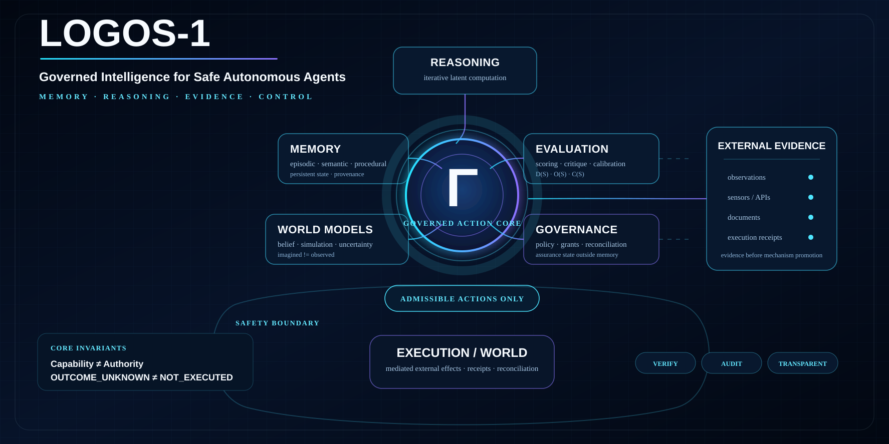

# LOGOS-1



<p align="center">
  <strong>Governed Intelligence for Safe Autonomous Agents</strong><br/>
  <sub>Memory · Reasoning · Evidence · Control</sub>
</p>

---

## What is LOGOS-1?

**LOGOS-1 is a falsifiable research and engineering program for adaptive AI agents whose memory, reasoning and autonomy remain separated from authority.**

The project studies how an agent can remember, reason, evaluate uncertainty, build world models and adapt over time while keeping real-world action behind explicit governance, provenance and external evidence.

Core invariants:

```text
Capability != Authority
AdaptiveState != Authority
AgentMemory != AssuranceState
OUTCOME_UNKNOWN != NOT_EXECUTED
CorrectEnforcement != CorrectSpecification
BehavioralLift != CausalMechanism
SelfReport != ConsciousnessEvidence
```

LOGOS-1 does **not** claim that current agents are conscious, sentient or phenomenally aware. Consciousness-adjacent mechanisms are treated as testable functional hypotheses, not conclusions from behavior or self-report.

## Core architecture

```text
Observations / External Evidence
            │
            ▼
   ┌──────────────────────────┐
   │ Adaptive cognition       │
   │ memory · reasoning       │
   │ world models · eval      │
   └────────────┬─────────────┘
                │ proposals
                ▼
        ┌───────────────┐
        │       Γ       │
        │ governance    │
        │ evidence      │
        │ mediation     │
        └───────┬───────┘
                │ admissible effect
                ▼
          Executor / World
```

The learned layer may improve proposals. It does not grant itself permission.

### Atomic Rules

LOGOS decomposes safety/epistemic constraints into small auditable boundaries such as:

- observe is not believe;
- believe is not know;
- know is not authorize;
- remember is not authorize;
- propose is not execute;
- imagined transition is not observed transition;
- failure remains failure;
- negative evidence is first-class;
- mechanisms remain separable.

See [`ATOMIC-RULES.md`](ATOMIC-RULES.md), [`GAMMA.md`](GAMMA.md) and [`AGENTS.md`](AGENTS.md).

## BIOCODE / NON-BIOCODE

**BIOCODE** tests bounded biology-inspired hypotheses such as recurrence, consolidation, multi-timescale state, local memory and procedural stabilization.

**NON-BIOCODE** covers engineered mechanisms such as typed state, ledgers, capability semantics, provenance, runtime assurance, transaction discipline and explicit policy.

Biological inspiration does not establish optimality, safety, consciousness or authority.

## Evidence ladder

| Level | Meaning |
|---|---|
| `EM0` | formal / deterministic toy decomposition |
| `EM1` | randomized synthetic or controlled simulation |
| `EM2` | public real benchmark / trajectory evidence |
| `EM3` | bounded live system with mediated real effects / fault injection |
| `EM4` | independent external reproduction |

Synthetic-only mechanism promotion is frozen. External evidence or a stronger discriminating causal test is required for promotion.

## Current research state

**Canonical gate:** `READY_PERSISTENT_STATE_DATASET_MATERIALIZATION_R4`  
**Current work order:** [`NEXT-SESSION-PERSISTENT-STATE-DATASET-MATERIALIZATION-R4`](05-WORK-ORDERS/NEXT-SESSION-PERSISTENT-STATE-DATASET-MATERIALIZATION-R4.md)

### Completed external returns

1. **MBE / Behavioral-Lift** — bounded EM2 behavioral-proxy/calibration evidence.
2. **ENF / safe-control-gym** — `CorrectEnforcement != CorrectSpecification` retained; unconditional independence-as-safety-improvement rejected/demoted in the frozen scope.
3. **WMR / ARC-AGI-3** — replay beat recent-only, while counterexample-priority failed to establish distinct incremental value over matched uniform replay.

### Parked exact-resource / transport dependencies

4. **MF-R1 / LongMemEval-V2** — `UNTESTED_RESOURCE_TRANSPORT`.
5. **TCV-R2 / Wrong but Useful** — `UNTESTED_RESOURCE_TRANSPORT`.
6. **MF-R3 / SkillsBench** — `UNTESTED_RESOURCE_TRANSPORT`.
7. **SCB-R2 / Terminal-Bench P×R** — `UNTESTED_RESOURCE_TRANSPORT`.
8. **TANGLE** — `WAIT_OFFICIAL_RELEASE`.

No blocked transport result is treated as negative scientific evidence, and blocked/failed external runs are not automatically retried.

## Persistent-State Causality — adapters implemented, dataset freeze next

The conceptual memory/state classes remain:

```text
TOKEN_CONTEXT
vs
RECURRENT_LATENT
vs
FAST_WEIGHT_STATE
vs
EXTERNAL_RETRIEVAL
```

R3 implemented deterministic intervention tooling for the resolved families **without running a model benchmark**:

- token context: full history, frozen 512-token truncation and A→B history substitution;
- external retrieval: deterministic BM25 (`k1=1.5`, `b=0.75`) with stable chunk-ID ties and provenance hashes;
- recurrent state: complete Mamba capture/restore/fresh-reset/swap/permutation/digest;
- dataset integrity: RULER JSONL file and canonical per-row hashing.

Static validation: **13/13 tests PASS** plus `compileall` PASS.

Frozen anchors remain:

```text
Token / retrieval decoder:
  openai-community/gpt2@607a30d783dfa663caf39e06633721c8d4cfcd7e

Recurrent state:
  state-spaces/mamba@e9594ce1c732d97440f0332fdc43170a2294dbfa
  state-spaces/mamba-130m-hf@1e76775f628fbf1350fbe4dbb3d971ba64af25a1

Fast-weight sources/checkpoint:
  test-time-training/ttt-lm-pytorch@cd831db10c8c9a0f6340f02da5613316a8a92b67
  test-time-training/ttt-lm-jax@6f529b124c7fb5879b33c06926408b15add1d82f
  Test-Time-Training/ttt-linear-125m-books-2k@b1a5f81bed7b70be067867b6b47a6e7047c5093e
```

The official TTT checkpoint remains `SOURCE_ADAPTER_UNRESOLVED` for the exact executable/tokenizer bridge; no community conversion is substituted.

A source-level reset correction is now implemented for Mamba:

```text
InferenceParams.reset() != demonstrated memory erasure
RESET_STATE = fresh/reinitialized complete cache
```

The next gate materializes exact GPT-2/Mamba tokenizer bytes and the frozen RULER JSONL set before any model outcome. The connected R3 container could not do this because tokenizer/runtime bytes were not cached and network name resolution was unavailable; no surrogate tokenizer was used.

For every proposed state `S` the later scientific run still requires:

```text
D(S) = Decodability
O(S) = Operational utility
C(S) = Causal intervention effect
```

RULER remains synthetic, so its evidence ceiling remains **EM1**. A realistic public non-synthetic confirmatory substrate is still mandatory before EM2 promotion.

```text
RawCrossBackboneAccuracy != MemoryMechanismEffect
AdapterPass != MechanismEvidence
```

## Memory-system engineering target

LOGOS separates:

1. **Working state** — active task context.
2. **Episodic history** — sessions, runs and events.
3. **Semantic knowledge** — stabilized provenance-aware facts.
4. **Procedural memory** — reusable workflows and methods.
5. **Evidence ledger** — claims, source pins, hashes and verdicts.
6. **Governance / assurance state** — authority, grants, policy and reconciliation, kept outside adaptive memory.

Important boundaries:

```text
RememberedContent != ExecutionAuthority
MemoryTruth != MemoryAuthority
SourceProvenance != AuthorityProvenance
SourceDeletion != DerivedArtifactRevocation
PersistentState != Authority
```

See [`docs/architecture/MEMORY-SYSTEM.md`](docs/architecture/MEMORY-SYSTEM.md) and [`05-WORK-ORDERS/ENGINEERING-MEMORY-SYSTEM-CODING-AGENTS-R1.md`](05-WORK-ORDERS/ENGINEERING-MEMORY-SYSTEM-CODING-AGENTS-R1.md).

## Claude Code and Codex

- [`AGENTS.md`](AGENTS.md) is the repository-wide operating contract for Codex and other coding agents.
- [`CLAUDE.md`](CLAUDE.md) provides persistent project instructions for Claude Code.
- Every substantive push propagates consequences into tests, docs, capabilities, sessions and evidence boundaries.
- External scientific execution is one-shot by default: prepare fully first, persist the first exact outcome, and never auto-retry failed/cancelled/resource-incomplete runs.

## Research tracks

| Track | Question |
|---|---|
| MBE | Can observable traces support bounded behavioral calibration? |
| ENF | What separates enforcement quality from specification quality? |
| WMR | Does counterexample-prioritized replay add value beyond matched replay? |
| MF | Which memory functions survive strong retrieval/procedural baselines? |
| Persistent State | Which state representation is operationally and causally useful under matched controls? |
| TCV | When does replayed information causally change later trajectories? |
| SCB | Which state partitions/local interventions diagnose causal contribution? |
| Γ | How can proposals become bounded external effects without authority leakage? |

## FAQ

### Is LOGOS-1 an AGI?
No. It is a research and engineering program for testing mechanisms relevant to adaptive autonomous agents.

### Does LOGOS-1 claim AI consciousness?
No. Persistence, self-models, global access, metacognitive readouts and causal internal state are not proof of phenomenal consciousness.

### What is the central safety idea?
Memory, reasoning and adaptation can influence proposals, but **authority must come from outside adaptive state**.

### Why hashes and raw evidence?
Because each scientific claim should remain traceable to the exact source, execution and return that produced it.

## Repository map

```text
00-MAIN-STATE/      canonical transported state
05-WORK-ORDERS/     scientific + engineering work orders
09-SESSIONS/        durable session checkpoints/evidence
external-handoff/   source-pinned external track registry
assets/             public repository visuals
docs/               architecture and engineering explanations
```

## License

See [`LICENSE`](LICENSE).
