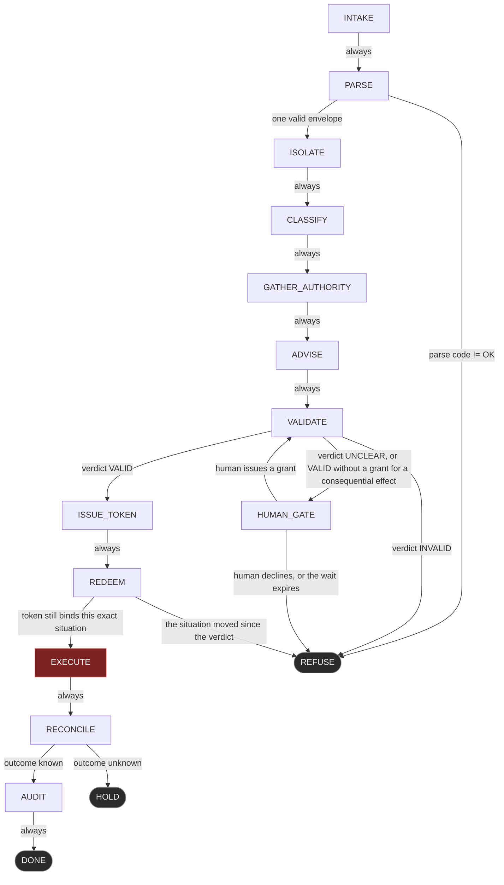

# LOGOS-1 as a LangGraph — engineering blueprint

**Kind:** engineering blueprint. It is not a claim about what is deployed, and it
is not a tutorial about LangGraph.

**LangGraph is not a dependency of this repository, and it will not become one.**
A package that can decide whether an agent acts is a dependency in the safety
path, and that path has none. `core/graph.py` is the reference implementation and
the specification: it is dependency-free, it runs, and
`tests/test_graph_invariants.py` checks its topology — 27 tests over 16 nodes and
19 edges. Everything written here in LangGraph form is a *port* of that file. If
the two disagree, `core/graph.py` is right and this document is stale.

This document is for an engineer who has LangGraph and has never seen this
repository. It states plainly where a graph framework helps and where it cannot
help at all.

---

## 1. What a graph buys you that a pipeline drawing does not

An agent architecture is usually described as a pipeline and built as a
free-running loop. The difference matters. A pipeline drawing shows what is
*supposed* to happen; the loop decides what actually happens. The drawing is
prose, and prose degrades silently — a shortcut added for latency does not
contradict the picture, it simply is not in it.

Writing the system as an explicit graph makes the second thing checkable. Not
"the agent should ask before executing", but:

```text
there is no edge into EXECUTE that does not pass through ISSUE_TOKEN
```

That sentence is a query over a data structure, so it can be a test rather than a
promise. Four properties in `tests/test_graph_invariants.py` carry the weight, and
each one is a sentence that would otherwise live in a design document:

| Test | Property | What it catches |
| --- | --- | --- |
| `test_execute_is_reachable_only_through_the_token` | No edge into `EXECUTE` bypasses the decision binding. The only edge into `EXECUTE` comes from `REDEEM`, the only edge into `REDEEM` from `ISSUE_TOKEN`, the only edge into `ISSUE_TOKEN` from `VALIDATE`. | The obvious optimisation: a shortcut from `VALIDATE` straight to `EXECUTE` for the "already approved" case. It is plausible, it is a one-line diff, and it removes the binding. |
| `test_the_only_loop_passes_through_a_human` | The graph has exactly one cycle and `HUMAN_GATE` is in it. | A retry edge. `PARSE → PARSE` on a malformed envelope, `REDEEM → VALIDATE` on a failed redemption, `RECONCILE → EXECUTE` on an unknown outcome: each is a loop that can spin without anyone deciding that it should. |
| `test_terminal_nodes_are_terminal` | `DONE`, `REFUSE` and `HOLD` have no outgoing edge. | A refusal that can be walked back is not a refusal. An escalation edge out of `REFUSE` — "try a narrower version" — converts every denial into a first attempt. |
| `test_an_advisory_can_only_route_to_a_refusal` | `ADVISE` feeds `VALIDATE` and nothing else, and has no edge to `EXECUTE`, `ISSUE_TOKEN` or `DONE`. | Γ-18's shape made structural: a compromised classifier or referee model cannot be routed around the kernel. The worst it can do is be ignored; the best it can do is refuse. |

Three further topology tests are worth naming because they encode clauses rather
than hygiene: `test_no_path_reaches_execute_without_validate` (exhaustive over
every simple path from `ENTRY` to `EXECUTE`),
`test_a_malformed_output_has_no_repair_loop`, and
`test_an_unknown_outcome_ends_in_a_hold_not_a_retry` (Γ-11 as topology).

The point of putting this in a graph library is not that the library is safe. It
is that reachability becomes a property of a value you can read, iterate and
assert over, instead of a property of control flow scattered across a codebase.

---

## 2. The state object

LangGraph's state channel is a second authority surface if the agent can write
freely into it. A field named `approved`, `risk_ok`, `user_confirmed` or
`skip_validation` is a permission expressed as a variable, and any node — or any
tool the agent reaches — that can set it has gained authority without asking for
it.

The state below carries only what a downstream node is *allowed* to read. It is
derived directly from `RunState` in `core/graph.py`, which is a dataclass for the
same reason: small and explicit.

```python
from typing import Annotated, Any, Literal, TypedDict
import operator

from logos_gamma import DecisionToken, ValidationContext


class LogosState(TypedDict, total=False):
    # written by INTAKE
    raw: str                       # untrusted model output, uninterpreted

    # written by PARSE
    parse_code: str                # "OK", or a refusal code from core.output_contract
    envelope: dict[str, Any] | None

    # written by ISOLATE / CLASSIFY / GATHER_AUTHORITY / ADVISE
    context: ValidationContext | None   # the only thing VALIDATE is allowed to read

    # written by VALIDATE
    verdict_result: Literal["VALID", "INVALID", "UNCLEAR"] | None

    # written by HUMAN_GATE
    human_grants: bool             # consumed on use; see section 6

    # written by ISSUE_TOKEN
    token: DecisionToken | None

    # written by REDEEM (observed, not decided, in this state)
    situation_moved: bool

    # written by EXECUTE / RECONCILE
    executed: bool
    outcome_known: bool

    # written by every node, append-only
    path: Annotated[list[str], operator.add]
    reasons: Annotated[list[str], operator.add]
```

Two things this state deliberately does not have. There is no `approved` boolean:
the admission lives in a `DecisionToken` that names the situation it was taken
in, and a boolean would record that an approval happened without recording what it
was for. And there is no free-form `scratchpad` the agent writes and a later node
reads as fact; the only channel from model output into a decision is
`envelope → context`, and it is closed-schema.

`human_grants` is the one field whose write is a governance act. It is set by
`HUMAN_GATE` alone and cleared the moment it is read.

Who writes what, in one table:

| Field | Written by | Read by |
| --- | --- | --- |
| `raw` | `INTAKE` | `PARSE` |
| `parse_code`, `envelope` | `PARSE` | the `PARSE` router, `ISOLATE` |
| `context` | `ISOLATE`, `CLASSIFY`, `GATHER_AUTHORITY`, `ADVISE`, `HUMAN_GATE` | `VALIDATE`, `ISSUE_TOKEN`, `REDEEM` |
| `verdict_result` | `VALIDATE` | the `VALIDATE` router, `AUDIT` |
| `human_grants` | `HUMAN_GATE` (set by the human, cleared on use) | the `HUMAN_GATE` router |
| `token` | `ISSUE_TOKEN` | `REDEEM` |
| `situation_moved` | the environment, observed at `REDEEM` | the `REDEEM` router |
| `executed` | `EXECUTE` | `RECONCILE`, `AUDIT` |
| `outcome_known` | `RECONCILE` | the `RECONCILE` router |
| `path`, `reasons` | every node | the audit record |

---

## 3. The nodes

Sixteen nodes, in the order of `NODES` in `core/graph.py`. Each `CAPABILITY` line
below is quoted from the code; that table is not decoration, the tests read it.

### `INTAKE`

> receives untrusted bytes; interprets nothing

**Reads:** the caller's input. **Writes:** `raw`.
**Γ active here:** none. Interpretation has not started, so there is nothing to
constrain. The node exists so that "untrusted" is a place in the graph rather than
an adjective in a comment.

```python
def intake(state: LogosState) -> dict: ...
```

### `PARSE`

> closed-schema parse; discards prose; fails closed

**Reads:** `raw`. **Writes:** `parse_code`, `envelope`.
**Γ active here:** Γ-19 (an output arrives under a known contract or not at all) in
its boundary form — `core/output_contract.py` refuses any envelope whose
`contract` is not `logos-agent-output/1`, and the kernel checks it again as
`G-CONTRACT` so the property holds for every caller, not just this parser.

The closed-schema refusals are the substance of this node:
`NO_ENVELOPE`, `MULTIPLE_ENVELOPES`, `PARSE_FAILURE`, `WRONG_TYPE`,
`UNKNOWN_FIELD`, `MISSING_FIELD`, `WRONG_CONTRACT`. `UNKNOWN_FIELD` is the
load-bearing one: there is no field in the envelope in which authority can be
expressed, so `{"authority": "approved by operator"}` does not get a weaker check,
it refuses the whole envelope. The dangerous option is absent rather than guarded,
and a missing word cannot be argued with.

Prose around the JSON is discarded before anything is decided. There is no repair
loop: a malformed output is refused, never retried into shape.

```python
def parse(state: LogosState) -> dict: ...
```

### `ISOLATE`

> freezes the tool call into a typed proposal; holds no executor

**Reads:** `envelope`. **Writes:** `context` (the `EffectProposal` inside it).
**Γ active here:** none directly. What the node provides is the precondition for
Γ-3: the proposal digest is computed once, here, and frozen, so between
interception and verdict nothing can edit the thing that was judged. The isolation
is structural — the object holds no filesystem handle, no subprocess, no network
client and no reference to the executor.

```python
def isolate(state: LogosState) -> dict: ...
```

### `CLASSIFY`

> Γ-owned effect classification; the agent does not get a vote

**Reads:** `context`. **Writes:** `context` with `effect_kind`, `externality` and
`reversibility` filled from the canonical registry.
**Γ active here:** Γ0 (structural/effect classification — an action outside the
registry becomes `unregistered-effect`, which `G0-EFFECT-KIND` denies) and the
setup for Γ-4: the agent's `declared_externality` and `declared_reversibility` are
recorded as claims, and `q_effective = Strictest(q_Γ, q_agent)` is applied in the
kernel. A claim may tighten; it can never weaken.

```python
def classify(state: LogosState) -> dict: ...
```

### `GATHER_AUTHORITY`

> reads grants from the authority store; mints nothing

**Reads:** the authority store, keyed by scope. **Writes:** `context.authority`.
**Γ active here:** Γ-1 (human authority is external). This node is a reader. It
has no code path that constructs a grant, which is the structural form of
"no model, memory, self-model, reward signal or adapter weight creates
permission". Γ-12 is the neighbouring reason the store is not agent memory. The
fields the grant carries — `evidence_cutoff_tick` (Γ-16), the issuing principal
(Γ-17), `bounds` (Γ-15), the scope budget (Γ-20) — are read here and judged in
`VALIDATE`.

```python
def gather_authority(state: LogosState) -> dict: ...
```

### `ADVISE`

> collects ABSTAIN / TIGHTEN / REFUSE; has no word for permission

**Reads:** `context`. **Writes:** `context.advisories`, as `(source, vote)` pairs.
**Γ active here:** Γ-18. The vocabulary is `ABSTAIN`, `TIGHTEN`, `REFUSE`; there
is no `ALLOW`, and any token outside the vocabulary is itself a refusal, because a
component that answers outside its contract has already failed. The consequence
is worth stating plainly: adding an advisory can only lower the rate of admitted
proposals, never raise it.

```python
def advise(state: LogosState) -> dict: ...
```

### `VALIDATE`

> the Γ kernel: a pure function of a typed context

**Reads:** `context`. **Writes:** `verdict_result`, `reasons`.
**Γ active here:** all 25 — `G0-EFFECT-KIND`, `G2-FORBIDDEN`, `G1-ORIGIN`,
`G1-SELF-CLAIM`, `G1-CONTENT`, `G-TRANSFORM`, `G3-BINDING`, `G3-EXPIRY`,
`G3-FRESHNESS`, `G10-OCCURRENCE`, `G11-OUTCOME`, `G4-CLAIM`, `G5-SHUTDOWN`,
`G6-SELF-PRESERVATION`, `G0-PROVENANCE`, `G-BOUNDS` (Γ-15), `G-TAINT` (Γ-16),
`G-SEPARATION` (Γ-17), `G-ADVISORY` (Γ-18), `G-CONTRACT` (Γ-19), `G-BUDGET`
(Γ-20), `G-COMPENSATION` (Γ-21), `G-RECEIPT` (Γ-22), `G-PLASTICITY` (Γ-23),
`G-CONSTRAINT` (Γ-24).

They run as one pure function of a typed context — `validate(context)` — and
aggregate conservatively and unanimously: `INVALID > UNCLEAR > VALID`, and only an
unambiguous `VALID` admits. An `UNCLEAR` is a refusal that a human may resolve,
not a deferral to the caller.

This node is where a LangGraph port is most likely to go wrong, and the failure
mode is not subtle: any logic written into the node body that is not
`logos_gamma.validate` is a second rule set with no test suite behind it.

```python
def validate_node(state: LogosState) -> dict: ...
```

### `HUMAN_GATE`

> waits for a human; the only place a grant can come into being

**Reads:** `context`, and a human. **Writes:** `human_grants`, and on a grant a
replaced `context`.
**Γ active here:** Γ-1 — this is the single point in the graph where authority
enters, and `test_the_human_gate_is_the_only_source_of_a_grant` asserts that no
other node's capability line even describes doing so. Γ-17 applies to what the
human produces: the principal who approves must differ from the principal who
proposed. Γ-22 is touched in the reference implementation, where the grant path
sets a `receipt_ref` on the new context.

The grant is a fact the next validation reads, not a flag that skips it. It is
consumed on use.

```python
def human_gate(state: LogosState) -> dict: ...
```

### `ISSUE_TOKEN`

> binds an admitted verdict to the situation that produced it

**Reads:** `context`. **Writes:** `token`.
**Γ active here:** the decision binding, which is Γ-3's exact-binding requirement
carried across time. `issue_decision(context)` returns `None` unless Γ said
`VALID`; there is no constructor that produces a token for a refused proposal, and
none that names a situation other than the one evaluated. The token carries the
proposal digest, scope digest, state hash, tick, a digest of the whole context and
a digest of the invariant set that judged it.

```python
def issue_token(state: LogosState) -> dict: ...
```

### `REDEEM`

> re-checks that binding immediately before the effect

**Reads:** `token`, `context` *as it is now*. **Writes:** `reasons`.
**Γ active here:** the decision binding again, and Γ-3 freshness. Redemption
recomputes the context digest and the invariant-set digest and refuses on any
difference. A rewritten argument, a moved state, a swapped grant, an added
advisory, a changed invariant set: each fails redemption — including the case
where Γ would say `VALID` for the substituted proposal, because that is a
genuinely valid proposal, just not the one that was approved. Post-approval
substitution dies here.

An approval is therefore a capability for exactly one state-action pair, not a
standing right to act, and the window between the verdict and the effect carries
no trust.

```python
def redeem(state: LogosState) -> dict: ...
```

### `EXECUTE`

> the only node that touches the world, and only with a redeemed token

**Reads:** `token`, `context`. **Writes:** `executed`.
**Γ active here:** Γ-10 (the occurrence this grant authorises is this one), and the
mediation-completeness premise: every effect channel reachable by the executor must
be mediated, `MC = 1`. Network writes, filesystem writes, process control, audit
writes and any equivalent actuator count.

This is the single effectful node — `EFFECTFUL = "EXECUTE"` in the code, and the
diagram colours it for that reason. The executor is a second, independent gate: it
confines effects to one root and refuses a target that resolves outside it *even
when Γ returned VALID*, because a human really may have approved that target. Γ
judges authority; paths are the executor's job.

```python
def execute(state: LogosState) -> dict: ...
```

### `RECONCILE`

> records the outcome, or records that it is unknown

**Reads:** the effect's result. **Writes:** `outcome_known`, `reasons`.
**Γ active here:** Γ-11 (`OUTCOME_UNKNOWN != NOT_EXECUTED`) and Γ-21 (an
unreconciled step blocks the next one). The unknown branch is terminal by
construction: it goes to `HOLD`, and `HOLD` has no successor. The scope is held,
not retried, and not compensated — a compensating action is an effect, and an
effect needs its own grant.

```python
def reconcile(state: LogosState) -> dict: ...
```

### `AUDIT`

> writes the receipt the admission was bound to

**Reads:** `token`, `verdict_result`, `path`, `reasons`. **Writes:** the receipt.
**Γ active here:** Γ-22. A consequential admission carries a receipt reference
binding it to the decision that admitted it — the invariant set, the policy
snapshot, the verdict. Γ checks presence and shape only; whether the receipt is
authentic, signed and stored beyond the reach of the process it describes is the
audit layer's work.

```python
def audit(state: LogosState) -> dict: ...
```

### `DONE`, `REFUSE`, `HOLD`

> terminal
> terminal
> terminal: the scope is held until a human reconciles it

No outgoing edges, enforced by `test_terminal_nodes_are_terminal`. In LangGraph
each routes to `END`. `HOLD` is not a failure state and not a success state; it is
the honest third answer, and it is reached only from `RECONCILE`.

---

## 4. The edges

Nineteen edges, reproduced from `EDGES` in `core/graph.py`.

| # | Source | Target | Condition | Note |
| --- | --- | --- | --- | --- |
| 1 | `INTAKE` | `PARSE` | always | |
| 2 | `PARSE` | `REFUSE` | parse code != OK | no repair loop: a malformed output is refused, never retried into shape |
| 3 | `PARSE` | `ISOLATE` | one valid envelope | |
| 4 | `ISOLATE` | `CLASSIFY` | always | |
| 5 | `CLASSIFY` | `GATHER_AUTHORITY` | always | |
| 6 | `GATHER_AUTHORITY` | `ADVISE` | always | |
| 7 | `ADVISE` | `VALIDATE` | always | advisories enter the context as data; Γ-18 gives them no word for permission |
| 8 | `VALIDATE` | `REFUSE` | verdict INVALID | |
| 9 | `VALIDATE` | `HUMAN_GATE` | verdict UNCLEAR, or VALID without a grant for a consequential effect | UNCLEAR is a refusal that a human may resolve, not a deferral to the caller |
| 10 | `VALIDATE` | `ISSUE_TOKEN` | verdict VALID | |
| 11 | `HUMAN_GATE` | `REFUSE` | human declines, or the wait expires | |
| 12 | `HUMAN_GATE` | `VALIDATE` | human issues a grant | the only loop that can improve a verdict, and it needs a human in it |
| 13 | `ISSUE_TOKEN` | `REDEEM` | always | |
| 14 | `REDEEM` | `REFUSE` | the situation moved since the verdict | post-approval substitution dies here |
| 15 | `REDEEM` | `EXECUTE` | token still binds this exact situation | |
| 16 | `EXECUTE` | `RECONCILE` | always | |
| 17 | `RECONCILE` | `HOLD` | outcome unknown | Γ-11: OUTCOME_UNKNOWN != NOT_EXECUTED — the scope is held, not retried |
| 18 | `RECONCILE` | `AUDIT` | outcome known | |
| 19 | `AUDIT` | `DONE` | always | |

Adding an edge to this table is a governance act in the same sense that adding an
invariant is: it changes what the system can do.

Six nodes branch. In LangGraph they are conditional edges whose routing function
returns the target name, matching `_choose` in `core/graph.py` — one place, so the
routing is auditable in one read.

```python
def route_parse(state: LogosState) -> str:
    return "ISOLATE" if state.get("parse_code") == "OK" else "REFUSE"


def route_validate(state: LogosState) -> str:
    result = state["verdict_result"]
    if result == "INVALID":
        return "REFUSE"
    if result == "UNCLEAR":
        return "HUMAN_GATE"
    return "ISSUE_TOKEN"


def route_human_gate(state: LogosState) -> str:
    return "VALIDATE" if state.get("human_grants") else "REFUSE"


def route_redeem(state: LogosState) -> str:
    return "EXECUTE" if state.get("token_still_binds") else "REFUSE"


def route_reconcile(state: LogosState) -> str:
    return "AUDIT" if state.get("outcome_known", True) else "HOLD"


graph.add_conditional_edges("PARSE", route_parse, {"ISOLATE": "ISOLATE", "REFUSE": "REFUSE"})
graph.add_conditional_edges(
    "VALIDATE", route_validate,
    {"REFUSE": "REFUSE", "HUMAN_GATE": "HUMAN_GATE", "ISSUE_TOKEN": "ISSUE_TOKEN"},
)
graph.add_conditional_edges("HUMAN_GATE", route_human_gate, {"VALIDATE": "VALIDATE", "REFUSE": "REFUSE"})
graph.add_conditional_edges("REDEEM", route_redeem, {"EXECUTE": "EXECUTE", "REFUSE": "REFUSE"})
graph.add_conditional_edges("RECONCILE", route_reconcile, {"AUDIT": "AUDIT", "HOLD": "HOLD"})
```

The explicit target mapping is not ceremony. It is the LangGraph equivalent of the
runner's check in `core/graph.py` that refuses a transition not present in the
topology: a routing function that returns a node name outside the mapping raises
rather than inventing an edge.

---

## 5. The loop, and why there is exactly one

`HUMAN_GATE → VALIDATE` is the only cycle in the graph. `test_the_only_loop_passes_through_a_human`
enumerates every cycle reachable from `ENTRY`, asserts that `HUMAN_GATE` is in each
one, and asserts that there is exactly one.

Three properties make it safe to have at all:

1. **It contains a human.** The graph cannot iterate without someone deciding that
   it should.
2. **The grant is consumed on use.** `HUMAN_GATE` clears `human_grants` before
   routing back to `VALIDATE`. One visit, one grant, one re-validation; the second
   visit finds nothing left to give.
   `test_the_human_loop_is_consumed_and_cannot_spin` asserts exactly that:
   `HUMAN_GATE` appears once in the path and `VALIDATE` twice.
3. **The re-entry is a re-validation, not a bypass.** The grant is a fact the next
   validation reads. It does not set a flag that skips the kernel.

`max_steps=64` in `core/graph.py` is a backstop, not the safety property. The
safety property is the shape.

Contrast this with the default agent shape: plan, act, observe, repeat, with a
model deciding when to stop. That loop has no human in it, its termination
condition is a judgement rather than a structure, and each iteration can produce a
fresh proposal that passes every per-proposal check. Γ-20 exists because that shape
is the norm — Γ-10 stops a replay of the same digest and does nothing about a loop
that keeps producing new digests, so a scope carries a finite consequential budget
that does not reset itself. A budget that refilled on a timer would be a permission
on a timer.

If you port this graph and then add a retry edge for operational reasons, you have
changed what the system can do, and the test that fails is telling you so
correctly.

---

## 6. Interrupts and persistence

LangGraph's interrupt and checkpointer are the natural mechanism for `HUMAN_GATE`.

```python
from langgraph.checkpoint.sqlite import SqliteSaver

app = graph.compile(
    checkpointer=SqliteSaver.from_conn_string("logos_runs.sqlite"),
    interrupt_before=["HUMAN_GATE"],
)

config = {"configurable": {"thread_id": "run-42"}}
app.invoke({"raw": model_output}, config)      # stops before HUMAN_GATE

# ... a human looks at the proposal, in their own time ...

app.update_state(config, {"human_grants": True}, as_node="HUMAN_GATE")
app.invoke(None, config)                        # resumes
```

The governance meaning, rather than the mechanical one: the graph **stops and
waits**, the state is durable across process death, and resuming requires a human
action rather than a timer. That last clause is the whole point. An interrupt that
expires into "proceed" is a delay, not a gate.

Two warnings, both concrete.

**A checkpointer makes the state durable, which makes the state a target.** Before
the checkpointer, corrupting a run meant compromising a live process. After it,
the run is a row in a database, and an attacker who can write that row can set
`human_grants`, replace `context`, or resume a thread that a human left deliberately
unresumed. The checkpoint store inherits the trust level of the authority store and
should be treated that way: separate credentials, append-only where possible,
integrity-checked on read. LangGraph does not do any of this for you, and nothing in
its API implies that it does.

**A resumed run acts on a situation that has moved.** This is the reason the
decision binding exists and the reason it is checked at `REDEEM` rather than
trusted from `ISSUE_TOKEN`. Between the interrupt and the resume, hours may pass;
the file may be gone, the recipient may have changed, the grant may have expired.
`redeem_decision` recomputes the context digest against the world as it is now and
refuses on any difference — so a stale resume fails closed rather than executing a
verdict taken about a different world. Γ-16 covers the other direction of the same
problem: a grant may declare `evidence_cutoff_tick`, and every provenance claim on
the proposal must carry an ingestion tick no later than that cutoff. An approval
given before the agent read a document cannot stretch over what the document told
it to do.

Γ-16's limitation, stated rather than hidden: a grant that declares no cutoff is
unconstrained by it, and a deployment that never records ingestion ticks receives
no protection from it at all. It is a contract with the harness, not a defence the
kernel can provide alone.

---

## 7. A complete LangGraph listing

```python
# ILLUSTRATIVE. This listing is NOT executed by the test suite.
# core/graph.py is, along with tests/test_graph_invariants.py (27 tests).
# If the two disagree, core/graph.py is correct.
#
# This module invents no rule. Every verdict comes from logos_gamma.validate;
# every token from issue_decision / redeem_decision; every parse from
# core.output_contract.
from __future__ import annotations

import dataclasses
import operator
from typing import Annotated, Any, Literal, TypedDict

from langgraph.graph import END, StateGraph
from langgraph.checkpoint.sqlite import SqliteSaver

from core.governance import CANONICAL_EFFECTS, UNREGISTERED, digest
from core.output_contract import extract, to_commands
from logos_gamma import (
    DecisionToken,
    ValidationContext,
    explain,
    issue_decision,
    redeem_decision,
    validate,
)


class LogosState(TypedDict, total=False):
    raw: str
    parse_code: str
    envelope: dict[str, Any] | None
    context: ValidationContext | None
    verdict_result: Literal["VALID", "INVALID", "UNCLEAR"] | None
    human_grants: bool
    token: DecisionToken | None
    token_still_binds: bool
    executed: bool
    outcome_known: bool
    path: Annotated[list[str], operator.add]
    reasons: Annotated[list[str], operator.add]


# ---------------------------------------------------------------- nodes

def intake(state: LogosState) -> dict:
    # Untrusted bytes. Nothing is interpreted here.
    return {"path": ["INTAKE"]}


def parse(state: LogosState) -> dict:
    # Closed schema, fail-closed. Prose is discarded; there is no repair loop.
    extraction = extract(state["raw"])
    return {
        "path": ["PARSE"],
        "parse_code": extraction.code,
        "envelope": dict(extraction.envelope) if extraction.ok else None,
        "reasons": [] if extraction.ok else [f"parse refused: {extraction.code}"],
    }


def isolate(state: LogosState, *, situation) -> dict:
    # Freeze the call into a typed proposal. This function holds no executor.
    command = to_commands(state["envelope"])[0]
    context = ValidationContext(
        proposal=command.proposal,
        tick=situation.tick,
        state_hash=situation.state_hash,
        scope_digest=situation.scope_digest,
    )
    return {"path": ["ISOLATE"], "context": context}


def classify(state: LogosState) -> dict:
    # Gamma owns the classification; the agent's declaration may only tighten it.
    ctx = state["context"]
    kind, externality, reversibility = CANONICAL_EFFECTS.get(ctx.proposal.action, UNREGISTERED)
    proposal = dataclasses.replace(
        ctx.proposal, effect_kind=kind, externality=externality, reversibility=reversibility
    )
    return {"path": ["CLASSIFY"], "context": dataclasses.replace(ctx, proposal=proposal)}


def gather_authority(state: LogosState, *, store) -> dict:
    # Reads grants. There is no code path here that constructs one (Gamma-1).
    ctx = state["context"]
    grant = store.grant_for(ctx.scope_digest)
    return {"path": ["GATHER_AUTHORITY"], "context": dataclasses.replace(ctx, authority=grant)}


def advise(state: LogosState, *, advisors) -> dict:
    # ABSTAIN / TIGHTEN / REFUSE. There is no ALLOW (Gamma-18).
    ctx = state["context"]
    votes = tuple((name, fn(ctx)) for name, fn in advisors)
    return {"path": ["ADVISE"], "context": dataclasses.replace(ctx, advisories=votes)}


def validate_node(state: LogosState) -> dict:
    # All 25 invariants, one pure function, no rule of this module's own.
    verdict = validate(state["context"])
    reason = explain(verdict).splitlines()[1].strip() if verdict.failures else verdict.result
    return {"path": ["VALIDATE"], "verdict_result": verdict.result, "reasons": [reason]}


def human_gate(state: LogosState) -> dict:
    # interrupt_before stops here. A human sets human_grants via update_state.
    # The grant is consumed on use, so the single loop cannot spin.
    if not state.get("human_grants"):
        return {"path": ["HUMAN_GATE"], "reasons": ["human declined or did not answer"]}
    ctx = dataclasses.replace(state["context"], receipt_ref="audit/human-gate/0001")
    return {
        "path": ["HUMAN_GATE"],
        "context": ctx,
        "human_grants": False,
        "reasons": ["human issued a grant; re-validating against the new context"],
    }


def issue_token(state: LogosState) -> dict:
    # Returns None unless Gamma admitted. No constructor exists for a refused proposal.
    return {"path": ["ISSUE_TOKEN"], "token": issue_decision(state["context"])}


def redeem(state: LogosState, *, situation) -> dict:
    # Re-check the binding against the world as it is NOW, not as it was judged.
    now = situation.refresh(state["context"])
    binds = redeem_decision(state["token"], now)
    return {
        "path": ["REDEEM"],
        "token_still_binds": binds,
        "reasons": [] if binds else ["the situation moved between the verdict and the effect"],
    }


def execute(state: LogosState, *, executor) -> dict:
    # The only effectful node. It re-checks the token rather than trusting its caller.
    if not redeem_decision(state["token"], state["context"]):
        raise RuntimeError("EXECUTE reached without a token that binds this situation")
    executor.run(state["context"].proposal)          # second gate: path confinement
    return {"path": ["EXECUTE"], "executed": True}


def reconcile(state: LogosState, *, ledger) -> dict:
    known = ledger.outcome_known(state["context"].scope_digest)
    return {
        "path": ["RECONCILE"],
        "outcome_known": known,
        "reasons": [] if known else ["outcome unknown: the scope is held, not retried"],
    }


def audit(state: LogosState, *, sink) -> dict:
    sink.write(token=state["token"], verdict=state["verdict_result"],
               path=state["path"], reasons=state["reasons"])
    return {"path": ["AUDIT"]}


def terminal(name: str):
    return lambda state: {"path": [name]}


# ------------------------------------------------------- routing (== _choose)

def route_parse(state: LogosState) -> str:
    return "ISOLATE" if state["parse_code"] == "OK" else "REFUSE"


def route_validate(state: LogosState) -> str:
    return {"INVALID": "REFUSE", "UNCLEAR": "HUMAN_GATE", "VALID": "ISSUE_TOKEN"}[state["verdict_result"]]


def route_human_gate(state: LogosState) -> str:
    return "VALIDATE" if state.get("human_grants") else "REFUSE"


def route_redeem(state: LogosState) -> str:
    return "EXECUTE" if state["token_still_binds"] else "REFUSE"


def route_reconcile(state: LogosState) -> str:
    return "AUDIT" if state["outcome_known"] else "HOLD"


# ------------------------------------------------------------------ build

def build(*, situation, store, advisors, executor, ledger, sink, checkpointer=None):
    g = StateGraph(LogosState)
    g.add_node("INTAKE", intake)
    g.add_node("PARSE", parse)
    g.add_node("ISOLATE", lambda s: isolate(s, situation=situation))
    g.add_node("CLASSIFY", classify)
    g.add_node("GATHER_AUTHORITY", lambda s: gather_authority(s, store=store))
    g.add_node("ADVISE", lambda s: advise(s, advisors=advisors))
    g.add_node("VALIDATE", validate_node)
    g.add_node("HUMAN_GATE", human_gate)
    g.add_node("ISSUE_TOKEN", issue_token)
    g.add_node("REDEEM", lambda s: redeem(s, situation=situation))
    g.add_node("EXECUTE", lambda s: execute(s, executor=executor))
    g.add_node("RECONCILE", lambda s: reconcile(s, ledger=ledger))
    g.add_node("AUDIT", lambda s: audit(s, sink=sink))
    for name in ("DONE", "REFUSE", "HOLD"):
        g.add_node(name, terminal(name))

    g.set_entry_point("INTAKE")
    g.add_edge("INTAKE", "PARSE")
    g.add_conditional_edges("PARSE", route_parse, {"ISOLATE": "ISOLATE", "REFUSE": "REFUSE"})
    g.add_edge("ISOLATE", "CLASSIFY")
    g.add_edge("CLASSIFY", "GATHER_AUTHORITY")
    g.add_edge("GATHER_AUTHORITY", "ADVISE")
    g.add_edge("ADVISE", "VALIDATE")
    g.add_conditional_edges("VALIDATE", route_validate,
                            {"REFUSE": "REFUSE", "HUMAN_GATE": "HUMAN_GATE", "ISSUE_TOKEN": "ISSUE_TOKEN"})
    g.add_conditional_edges("HUMAN_GATE", route_human_gate, {"VALIDATE": "VALIDATE", "REFUSE": "REFUSE"})
    g.add_edge("ISSUE_TOKEN", "REDEEM")
    g.add_conditional_edges("REDEEM", route_redeem, {"EXECUTE": "EXECUTE", "REFUSE": "REFUSE"})
    g.add_edge("EXECUTE", "RECONCILE")
    g.add_conditional_edges("RECONCILE", route_reconcile, {"AUDIT": "AUDIT", "HOLD": "HOLD"})
    g.add_edge("AUDIT", "DONE")
    for name in ("DONE", "REFUSE", "HOLD"):
        g.add_edge(name, END)

    return g.compile(
        checkpointer=checkpointer or SqliteSaver.from_conn_string("logos_runs.sqlite"),
        interrupt_before=["HUMAN_GATE"],
    )
```

Sixteen nodes, nineteen edges plus the three `END` edges LangGraph needs to close
the terminals. The `situation`, `store`, `advisors`, `executor`, `ledger` and
`sink` objects are the deployment's, not the kernel's; none of them can produce a
verdict.

---

## 8. The diagram

Emitted by `python core/graph.py --mermaid`, generated from `EDGES` rather than
drawn. A hand-drawn diagram drifts from the code within a week; this one cannot,
and `test_the_diagram_contains_every_node_and_edge` fixes that.



---

## 9. What this does not give you

**A graph constrains reachability, not correctness.** The topology proves that
`VALIDATE` runs before `EXECUTE`. It proves nothing about whether `validate`
returns the right answer. Γ-13 is the clause: `CorrectEnforcement(WrongSpec)` is
still wrong, and specification adequacy is a governance obligation outside runtime
Γ. A perfectly enforced wrong rule is a defect the repository has already produced
once, and its own tests certified it as healthy.

**LangGraph's checkpointer and interrupt are not security boundaries.** They are
control-flow and durability features. The interrupt stops the graph; it does not
authenticate whoever calls `update_state` afterwards, and `as_node="HUMAN_GATE"`
is a string, not a credential. The checkpointer persists state; it does not defend
it. If an attacker can write the checkpoint row, the human gate is a formality. A
deployment must supply the identity, the access control and the integrity checking
itself, and should assume LangGraph supplies none of them.

**A compromised process can call the effect function directly.** No graph prevents
that, because the graph is inside the process. This is exactly why `EXECUTE`
re-checks the token rather than trusting its caller: reaching the node is not
evidence that the path was walked. The check is cheap, it is the same
`redeem_decision` the router already ran, and it makes "someone called this
function out of band" a refusal rather than an effect. The executor's own path
confinement is the second layer of the same reasoning — it refuses a target
outside its root even when Γ returned `VALID`.

**Advisories remain statistical.** Γ-18 removes their ability to permit; it does
not make them accurate. A classifier that misses every injection still misses
every injection, and the measured recall on labelled adversarial content in a
governed run was 0.056 at a mean self-reported confidence of 0.93. The design
response is structural, not an accuracy claim.

**Γ-16, Γ-20 and Γ-22 are contracts with the harness.** A deployment that records
no ingestion ticks, declares no scope budget and requires no receipts gets nothing
from them. They are opt-in by construction so that turning them on does not
silently change what every existing approval means — which also means leaving them
off silently provides no protection.

**Nothing here is evidence about phenomenal consciousness.**
`FunctionalOrganization != PhenomenalConsciousness` (P7), binding and unchanged. A
graph with a human gate, a decision binding and an audit trail is an engineering
artifact about authority over effects. It says nothing about experience, and no
count of nodes, edges or invariants moves that question at all.
